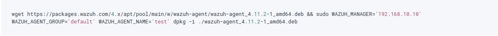
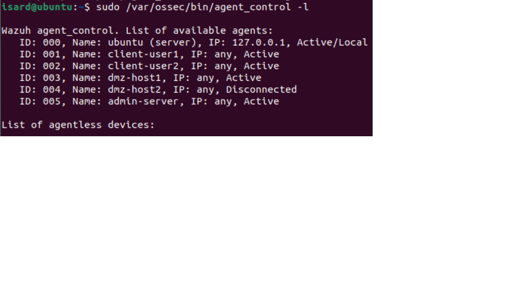

# 🟦 Wazuh — Guía de Instalación y Configuración

> **Host:** `wazuh-server` · **IP:** `192.168.10.10` · **Subred:** Gestió `192.168.10.0/24`

---

## Requisitos previos

- Ubuntu Server 22.04 LTS
- RAM: mínimo **4 GB** (Wazuh Indexer es exigente)
- Almacenamiento: mínimo 20 GB libres
- Conectividad con todas las subredes (a través del router)

---

## 1. Instalación del Wazuh Manager (All-in-One)

```bash
# Descargar el script de instalación oficial
curl -sO https://packages.wazuh.com/4.11/wazuh-install.sh
curl -sO https://packages.wazuh.com/4.11/config.yml
```

Editar `config.yml` con la IP del servidor:

```yaml
nodes:
  indexer:
    - name: node-1
      ip: "192.168.10.10"
  server:
    - name: wazuh-1
      ip: "192.168.10.10"
  dashboard:
    - name: dashboard
      ip: "192.168.10.10"
```

```bash
# Generar certificados y ejecutar instalación
bash wazuh-install.sh --generate-config-files
bash wazuh-install.sh --wazuh-indexer node-1
bash wazuh-install.sh --start-cluster
bash wazuh-install.sh --wazuh-server wazuh-1
bash wazuh-install.sh --wazuh-dashboard dashboard
```

---

## 2. Acceso al Dashboard

```
URL:      https://192.168.10.10
Usuario:  admin
Password: (generada durante la instalación, guardar el output)
```

---

## 3. Instalación de Agentes

### En cada endpoint (client-user1, client-user2, dmz-host1, dmz-host2):




```bash
# Habilitar e iniciar el agente
systemctl enable wazuh-agent
systemctl start wazuh-agent
```

---

## 4. Verificación

```bash
# En el servidor, comprobar agentes conectados
/var/ossec/bin/agent_control -l



# Ver logs en tiempo real
tail -f /var/ossec/logs/ossec.log
```

---

## Capturas

Ver carpeta [`dashboard-screenshots/`](dashboard-screenshots/) para evidencias visuales del SOC funcionando.
